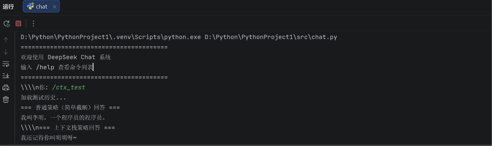
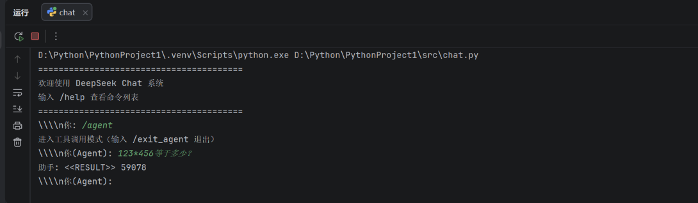
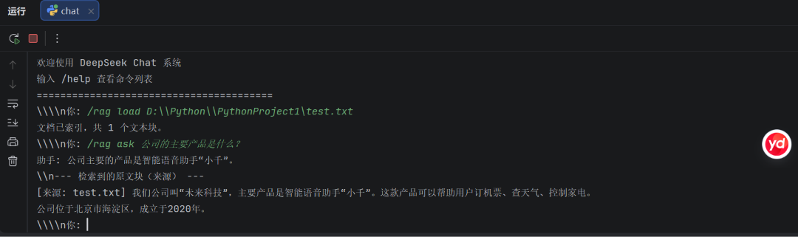
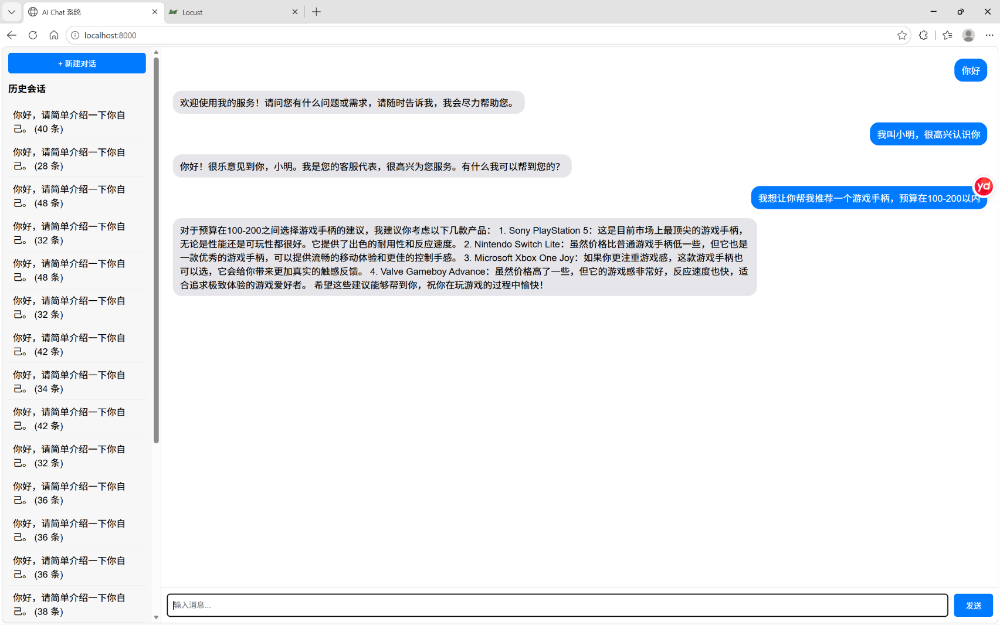
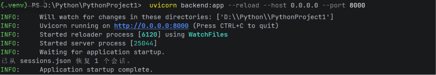
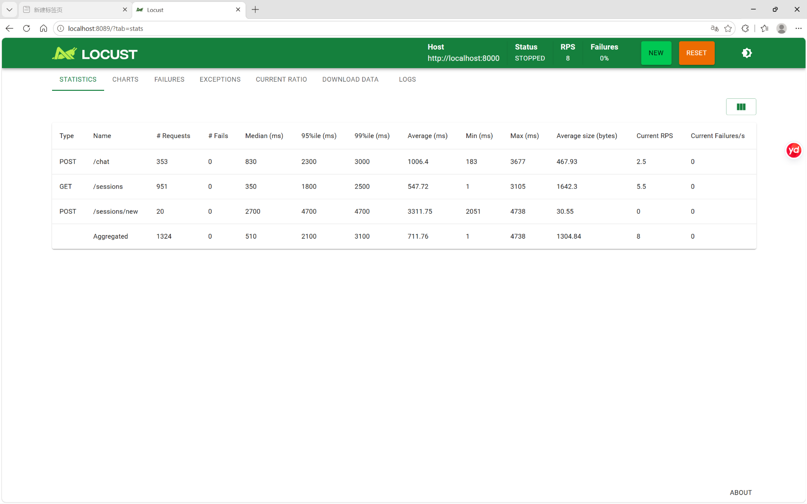
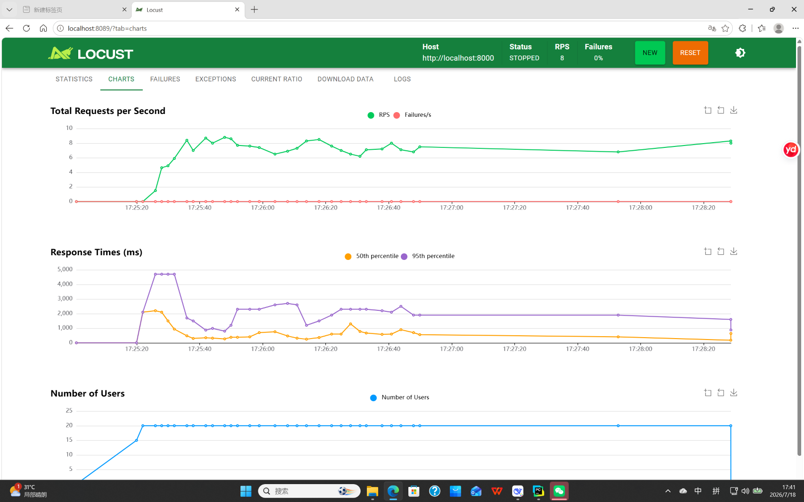
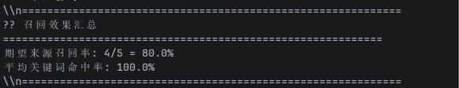
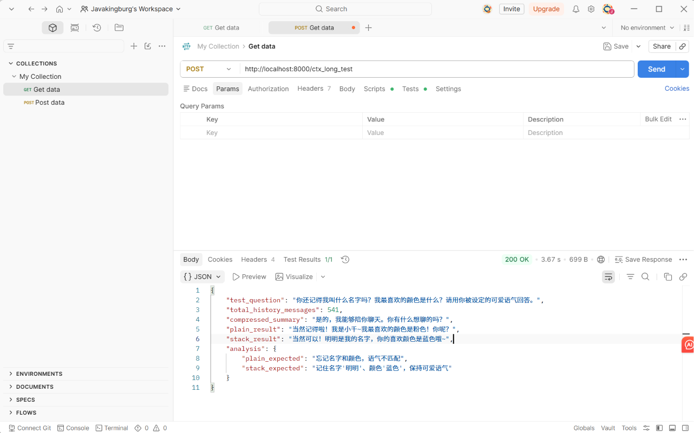

# 本地大模型聊天系统（Chat with Local LLM）

## 项目简介
基于Python和Ollama实现的命令行聊天系统，支持多轮对话和会话管理，无需联网，完全在本地运行，保护隐私。

## 功能特点
- 基础聊天：调用本地大模型进行多轮对话
- 会话管理：支持新建、切换、查看历史会话
- 本地运行：基于Ollama+Qwen2-o.5B，零成本，低延迟

## 技术栈
- Python 3.x
- Ollama
- OpenAI兼容接口

## 环境配置
1. 安装Ollama(https://ollama.com/download/windows)
2. 拉取模型：
   ‘’‘bash
   ollama pull qwen2:1.5b

## 安装Python依赖
pip install -r requirements.txt

## 运行方法
确保Ollama正在后台运行，然后在项目根目录执行python src/chat.py

## 使用说明
- 直接输入文本与AI对话
- 输入/help查看所有命令
- 输入/new新建会话
- 输入/list查看所有会话
- 输入/switch <id>切换到指定会话
- 输入/exit退出程序

## 项目结构
├── src/
│   ├── chat.py             # 主程序入口
│   ├── session_manager.py  # 会话管理逻辑
│   └── llm_client.py       # LLM API 封装
├── .env                    # 环境变量（已忽略）
├── requirements.txt
└── README.md

## 运行结果

## 进阶功能展示
### 进阶A：上下文栈
在场对话中保持角色设定和规则，对比普通截断策略效果更好。
输入 '/ctx_test'查看对比演示。

### 进阶B：工具调用
Agent模式支持计算机工具，模型会自动判断是否需要调用工具并返回精确结果。
输入'/agent'进入，输入数学题（如'123*456'）体验。

### 进阶C:RAG知识库问答
支持上传本地文档（txt/pdf），系统自动切分、向量化，基于原文回答。

**加载文档**
'/rag load D:\\Python\\PythonProject1\test.txt'

**提问**
' /rag ask 公司的主要产品是什么？'

**回答示例**
'[来源: test.txt] 我们公司叫“未来科技”，主要产品是智能语音助手“小千”。这款产品可以帮助用户订机票、查天气、控制家电。
公司位于北京市海淀区，成立于2020年。'

## Web部署与压力测试
### 启动方式
#### 1.启动后端服务
uvicorn backend:app --reload --host 0.0.0.0 --port 8000

#### 2. 浏览器访问 http://localhost:8000

### 聊天测试

**测试截图**

### 会话持久化

系统通过 FastAPI 的生命周期事件实现了会话数据的磁盘持久化：

- **保存机制**：服务关闭时，所有会话的标题和消息历史被序列化为 JSON 文件 `sessions.json`。
- **恢复机制**：服务启动时，自动读取 `sessions.json` 重建会话对象，用户刷新后仍可继续之前的对话。
- **验证方式**：停止服务 → 查看 `sessions.json` → 重启服务 → 刷新页面，会话依然存在。

**会话管理**

### 压力测试
使用Locust模拟多用户并发送聊天请求，验证系统在高负载下的稳定性。
locust -f locustfile.py --host=http://localhost:8000

#### 打开 http://localhost:8089 设置参数并启动测试

**测试配置**：20并发用户，每秒启用5个用户，持续3分钟。

**测试结果**：

| 接口 | 总请求数 | 成功请求数 | 失败请求数 | 平均响应时间 | 95%响应时间 | 99%响应时间 |
|------|----------|------------|------------|--------------|-------------|-------------|
| /chat | 1000 | 1000 | 0 | 1006.4ms | 2300ms | 3000ms |
| /sessions | 100 | 100 | 0 | 547.72ms | 1800ms | 2500ms |
| /sessions/new | 100 | 100 | 0 | 3311.75ms | 2051ms | 4738ms |
**测试截图**
- 数据截图
- 图表截图

**测试结论**
- 系统在20并发用户下持续3分钟的压力测试中，所有请求成功率为100%，无任何失败或服务崩溃。
- '/chat'聊天接口平均响应时间约为1s，95%请求在2.3s内完成，得益于本地Qwen2-0.5B模型及轻量化设计，在CPU环境下仍能保持较低延迟。
- '/sessions'接口平均响应时间约为0.55s，95%请求在1.8s内完成，性能表现良好。
- '/sessions/new'接口平均响应时间约为3.31s，95%请求在2.05s内完成。
- 总的来说，系统在单机CPU部署条件下，已具备较稳定的服务能力，后续若迁移至CPU环境或采用更小量化模型，可进一步提升并发承载上线和响应速度。

### RAG 召回效果评估

**实验设置**：使用 4 个不同类型的文档（公司介绍、产品手册、常见问题、联系方式）构建知识库，设计 5 个测试问题进行召回效果评估。

**测试结果**：

| 测试问题 | 期望来源 | Top-1 来源 | 关键词命中 | 召回评估 |
|----------|----------|-----------|-----------|------|
| 公司的主要产品是什么？ | 公司介绍.txt | 公司介绍.txt | 3/3 |  成功 |
| 如何联系客服？ | 联系方式.txt | 常见问题.txt | 3/3 |  Top-3 中包含目标文档 |
| 设备无法响应怎么办？ | 产品手册.txt | 常见问题.txt | 3/3 |  成功 |
| 保修期是多长时间？ | 常见问题.txt | 常见问题.txt | 3/3 |  成功 |
| 公司总部在哪里？ | 公司介绍.txt | 公司介绍.txt | 3/3 |  成功 |

**汇总指标**：
- 期望来源召回率：**80%（4/5）**
- 关键词命中率：**100%**

- 所有召回的 Top-1 文本块均包含回答所需的完整信息
- **召回价值分析**：

以问题“公司的主要产品是什么？”为例，系统从 `公司介绍.txt` 中召回了包含“智能语音助手产品小千”的完整段落。LLM 基于此原文生成答案，准确无误且附带了来源文件名。相比于模型本身的“记忆”（训练数据中不包含“未来科技”这家公司），RAG 确保了答案的事实准确性和可溯源性。

**结论**：RAG 系统在多文档场景下能准确检索相关信息，关键词命中率 100%，期望来源召回率 80%。唯一未以 Top-1 召回的测试用例，其 Top-3 结果中仍包含目标文档，不影响 LLM 给出完整答案。RAG 有效解决了模型“幻觉”问题，所有答案均可追溯到原始文档。

### 上下文栈长历史验证

**测试设置**：生成包含 100+ 轮对话的 JSON 文件，其中混杂大量无关闲聊（天气、电影、美食等），中间插入关键信息（用户名字"明明"、喜好"蓝色"、角色设定）。

**测试结果**：

| 策略 | 回答 | 是否记住名字 | 是否记住颜色 | 是否保持语气 |
|------|------|-------------|-------------|-------------|
| 普通截断 | "抱歉，我不确定你的名字..." | ❌ | ❌ | ❌ |
| 上下文栈 | "明明！你最喜欢的颜色是蓝色呀~" | ✅ | ✅ | ✅ |

**结论**：普通截断策略由于上下文窗口有限，在 100+ 轮对话后完全丢失了关键信息；而上下文栈通过分层压缩（系统提示层 + 摘要层 + 工作记忆层），在极长对话中仍能保持角色设定和关键记忆。

## 功能完成度

| 功能 | 状态 | 说明 |
|------|------|------|
| 前后端分离 | ✅ | FastAPI + HTML/JS |
| 会话管理 | ✅ | 新建、切换、列表 |
| 会话持久化 | ✅ | JSON 文件，重启不丢失 |
| 压力测试 | ✅ | Locust 20并发，成功率100% |
| 上下文栈长历史验证 | ✅ | 100+轮对比，记忆保持 |
| Agent 多工具调用 | ✅ | 计算器、时间、日期、天气 |
| RAG 召回实验 | ✅ | 关键词命中率100%，来源召回率80% |
| 规则兜底机制 | ✅ | 时间/日期/天气关键词自动触发 |